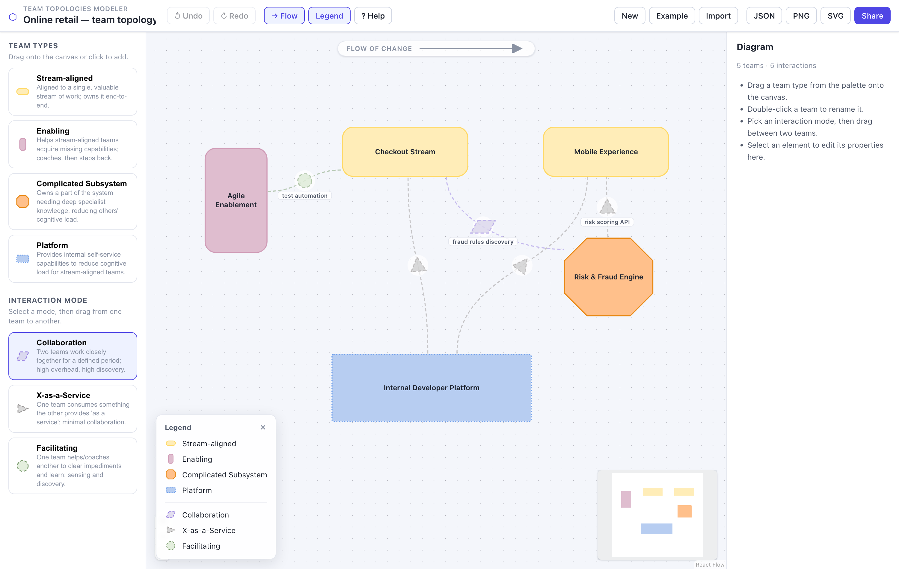

# Team Topologies Modeler

A fast, offline-friendly web app for drawing **Team Topologies** diagrams — the
four team types and three interaction modes from the book by Matthew Skelton &
Manuel Pais.

It is the spiritual sibling of
[Miragon's Wardley Maps Modeler](https://github.com/Miragon/wardley-maps-modeler):
same "full-bleed canvas + floating chrome" editing feel and the same emphasis on
a clean, DOM-free domain model with lossless, version-controllable files — but
built around the Team Topologies notation and powered by
[React Flow](https://reactflow.dev) for ergonomic node/edge modelling.



## Notation

Shapes, colours and stroke styles follow the official
[Team-Shape-Templates](https://github.com/TeamTopologies/Team-Shape-Templates).
Team shapes are **solid** (long-lived); interaction shapes are **dashed and 50 %
translucent** (short-lived). Every element is distinguished by shape as well as
colour, so diagrams stay readable with colour-vision deficiency.

### Team types

| Type | Shape | Fill / Outline |
| --- | --- | --- |
| Stream-aligned | horizontal rounded rectangle | `#FFEDB8` / `#FFD966` |
| Enabling | vertical rounded rectangle | `#DFBDCF` / `#D09CB7` |
| Complicated Subsystem | octagon | `#FFC08B` / `#E88814` |
| Platform | square-cornered rectangle (dotted) | `#B7CDF1` / `#6D9EEB` |

### Interaction modes

| Mode | Badge | Fill / Outline |
| --- | --- | --- |
| Collaboration | parallelogram | `#C6BEDF` / `#967EE2` |
| X-as-a-Service | triangle (points provider → consumer) | `#B4B4B4` / `#999696` |
| Facilitating | circle | `#C9DFBE` / `#78996B` |

## Features

- **Drag-and-drop palette** for the four team types, plus click-to-add.
- **Interaction modeling**: pick a mode, then drag from one team to another. Edges
  route cleanly between node borders ("floating edges") and carry the mode badge.
- **Inline editing** (double-click a team), an **inspector** for names,
  descriptions, type, colours and interaction direction.
- **Cognitive load** expressed by **resizing** team shapes.
- **Flow of change** guide (left-to-right) you can toggle.
- **Undo/redo**, keyboard shortcuts, autosave to `localStorage`.
- **Import/export** the lossless `.ttm.json` document, **export PNG/SVG**, and
  **share** a whole diagram as a single self-contained URL (LZ-compressed, no
  backend).
- An **example diagram** to start from.

## Getting started

Requires [pnpm](https://pnpm.io) (workspaces). From the repo root:

```bash
pnpm install
pnpm dev          # start the @tt-modeler/web dev server
pnpm build        # type-check every package, then build the app
pnpm test         # run the unit tests (Vitest) across all packages
pnpm typecheck    # per-package tsc type-check (no emit)
```

> Using `pnpm run <script>`? This repo allows the `esbuild` build script via
> `pnpm-workspace.yaml`. If your pnpm prompts to approve builds, accept `esbuild`.

## Architecture

A **pnpm-workspace monorepo** (mirroring the reference project's
`packages/* + apps/*` layout) with a strict boundary between the pure model and
the view:

```
packages/
  model/      @tt-modeler/model     — DOM-free core: types, notation spec, Zod
                                       schema, deterministic JSON, factory, the
                                       example document. No React, no DOM.
  renderer/   @tt-modeler/renderer  — React Flow layer: custom team nodes, the
                                       interaction edge, floating-edge geometry,
                                       the editor store, document <-> flow
                                       converters. Depends on @tt-modeler/model.
apps/
  web/        @tt-modeler/web       — the editor application: app shell, UI
                                       panels (toolbar/palette/inspector/legend/
                                       help/toasts), IO (JSON/PNG/SVG/share),
                                       autosave & keyboard shortcuts, styles.
```

The `model` package compiles **without the DOM lib**, so a stray browser import
fails type-checking — the DOM-free boundary is enforced, not just documented.
Cross-package imports use the package names (`@tt-modeler/model`,
`@tt-modeler/renderer`); the app consumes the packages straight from their TS
source via the workspace, so there is no separate library build step.

Design choices:

- **Deterministic serialisation** (sorted, rounded, fixed key order) makes
  `.ttm.json` files diff-friendly and gives stable share URLs.
- **Runtime validation** (Zod) on everything imported from files / URLs /
  localStorage, with a forward-migration hook keyed by document `version`.
- **React Flow** instead of diagram-js: a much shorter path to custom node
  shapes, typed edges and drag-to-connect for this node-centric notation. React
  Flow's small attribution link is kept visible per its MIT licence.

## Document format

`.ttm.json` is a small, stable JSON document:

```jsonc
{
  "version": 1,
  "title": "Online retail — team topology",
  "showFlowOfChange": true,
  "nodes": [
    {
      "id": "team_checkout",
      "type": "stream-aligned",
      "label": "Checkout Stream",
      "position": { "x": 320, "y": 110 },
      "size": { "width": 240, "height": 96 }
    }
  ],
  "interactions": [
    {
      "id": "int_platform_checkout",
      "mode": "x-as-a-service",
      "source": "team_platform",
      "target": "team_checkout"
    }
  ]
}
```

## Licence

MIT. "Team Topologies" is a trademark of Team Topologies Ltd; this is an
independent, unaffiliated tool that implements their openly published notation.
