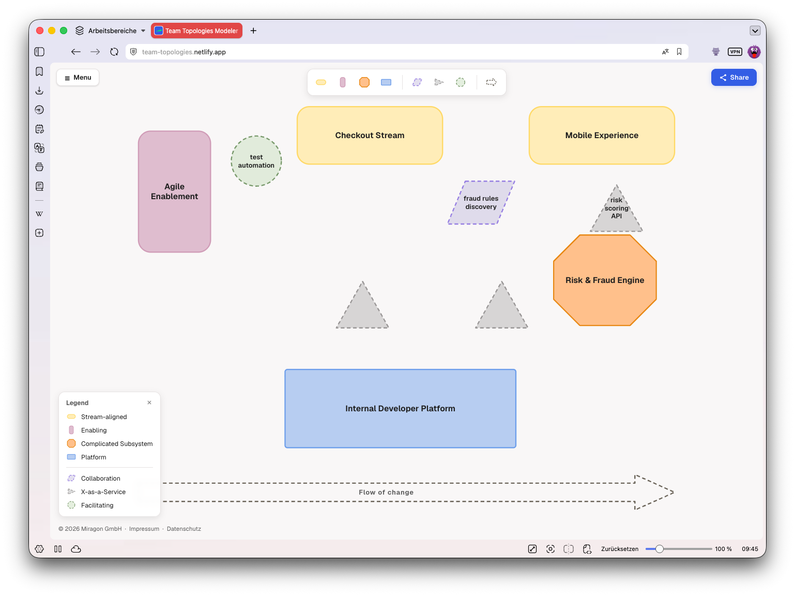

# Team Topologies Modeler — Web App

[](https://github.com/Miragon/team-topologies-modeler/blob/main/LICENSE)

The browser editor for [Team Topologies](https://teamtopologies.com/) diagrams — a Vite + React app
built on the shared [`@miragon/team-topologies-renderer`](../../packages/renderer) core. An
**Excalidraw-style full-bleed canvas** with floating chrome: no header bar, the tools sit over the
diagram. **No backend** — everything is local, and a diagram is shared by encoding it into the URL.



## Highlights

- **Full-bleed canvas + floating chrome.** Palette top-centre (from the renderer), a **☰ Menu** top-left
  and a **Share** button top-right; a property **Inspector** appears top-right on selection; a **Legend**
  bottom-left.
- **Edit by direct manipulation.** Drag from the palette to create, move, resize (resize a team to
  express cognitive load), inline-edit labels, undo/redo — all from the diagram-js core.
- **Inspector.** For the selected element: change team type / interaction mode, edit name and
  description, pick custom fill & outline colours (with a reset), or delete.
- **Share via URL, no server.** **Share** copies a self-contained link — the whole diagram is
  LZ-compressed into the URL hash (`#d=…`). Opening that link restores the diagram.
- **Autosave.** Every edit is debounced to `localStorage` and mirrored into the address bar, so a
  reload brings your work back.
- **Import / export.** Open a `.ttm.json` file, export **JSON**, **SVG** or **PNG** (rasterised at 2×),
  start a **New** diagram, or load the bundled **example** topology.
- **Offline-friendly.** No CDN calls; the type fallback degrades cleanly to the system sans stack.

## Run it

From the repo root (Node ≥ 22.13):

```bash
npm install
npm run dev:webapp            # http://localhost:5181
```

Or, for a stable per-worktree URL via [Portless](https://portless.sh) (`https://<worktree>.localhost`,
one-time host setup — see [`CONTRIBUTING.md`](../../CONTRIBUTING.md)):

```bash
npm run dev:webapp:portless
```

Production build (also what Netlify runs):

```bash
npm run build:webapp          # → apps/webapp/dist
```

On first load the app shows, in priority order, a diagram from a **shared link** (`#d=…`), then the
**autosaved** diagram from `localStorage`, then the bundled **example**.

## How it works

A thin React shell over the framework-agnostic modeler:

- **`DiagramCanvas`** mounts the `Modeler` from
  [`@miragon/team-topologies-renderer`](../../packages/renderer) into a `<div>` and loads the initial
  document.
- **State** — a React context mirrors modeler events (selection, undo/redo availability, title,
  revision) into React; small **Zustand** stores hold UI-only state (legend/help panels) and toasts.
  The diagram itself stays owned by diagram-js, not by React.
- **Sharing / persistence** — `serializeDocument()` →
  `LZString.compressToEncodedURIComponent` → `#d=…`. Autosave writes the same to `localStorage`
  (debounced ~600 ms) and to the address bar; very large diagrams skip the hash and rely on
  `localStorage`.
- **Export** — JSON via `serializeDocument()`; SVG via `modeler.saveSVG()`; PNG by rasterising that
  SVG onto a canvas.

The renderer and schema-model packages are aliased to their **TypeScript source** in `vite.config.ts`,
so there is no separate library build step — `npm run dev:webapp` and the Netlify build compile the
whole monorepo from source.

## Deployment

Deployed on **Netlify** (config in [`netlify.toml`](../../netlify.toml)): build `npm run build:webapp`,
publish `apps/webapp/dist`, Node 22, with an SPA catch-all redirect to `index.html` (hash-based
routing).

## License

[MIT](../../LICENSE).
